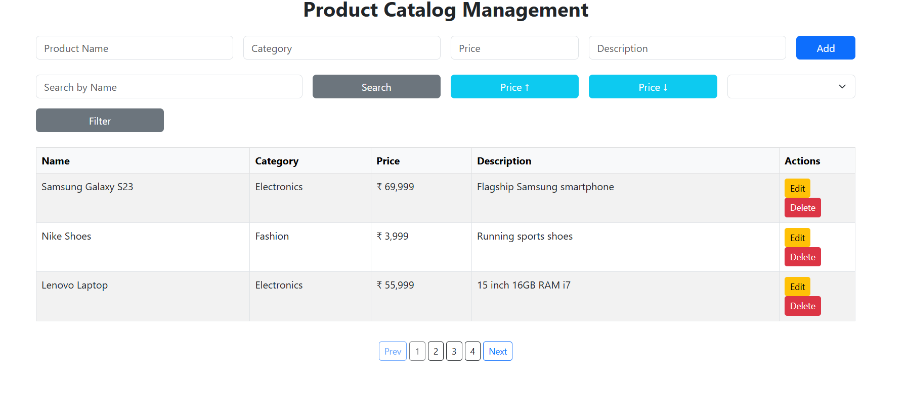
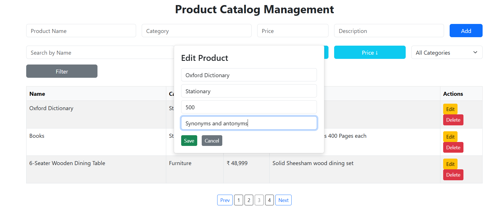
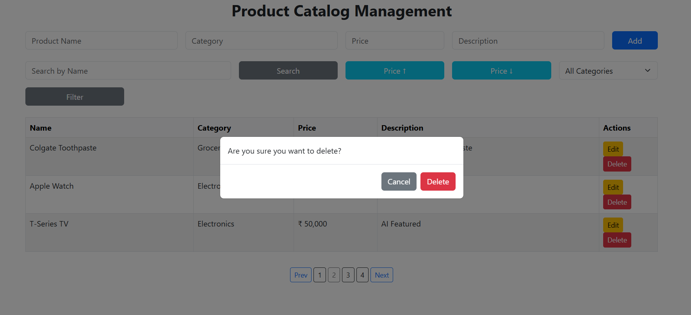
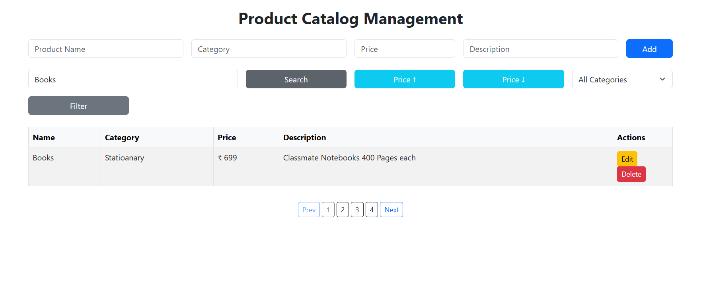
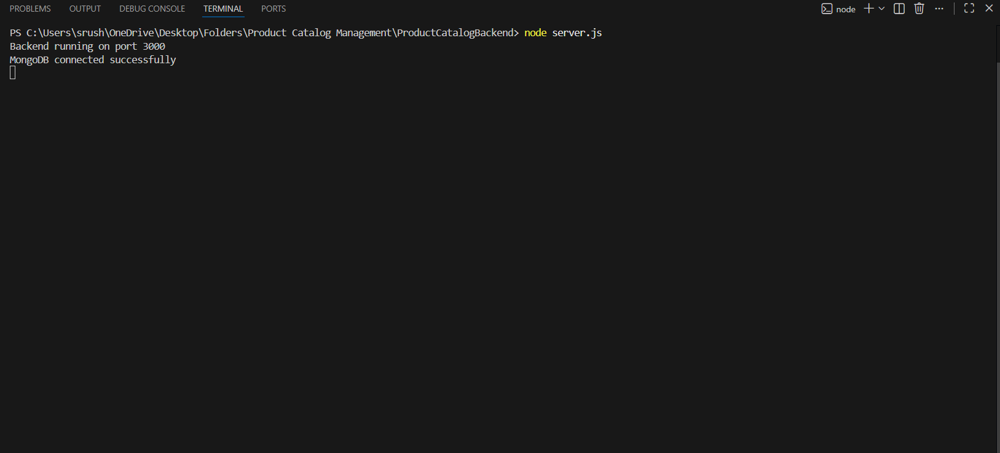
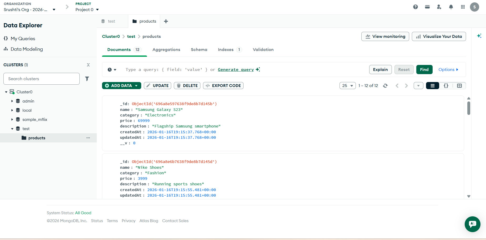

# 🛒 Product Catalog Management Web App

A full-stack web application for managing products with **CRUD**, **Search**, **Filter**, **Sort**, and **Pagination**, built using **Node.js**, **Express**, **MongoDB**, and **Bootstrap**.

---
🌍 Live Demo

Frontend (GitHub Pages):
👉https://srushtidumbhare7-ad.github.io/product-catalog-management/

Backend (Render Deployment):
👉 https://product-catalog-management.onrender.com

📂 Repository

GitHub Repo:
👉 https://github.com/srushtidumbhare7-ad/product-catalog-management

## 🚀 Features

* Add, Edit, Delete products
* Search products by name
* Filter products by category
* Sort products by price (ASC/DESC)
* Pagination for better navigation
* Dynamic categories
* Modal confirmation for delete
* Loader spinner
* Toast notifications
* Clean and responsive UI

---

## 🏗 Tech Stack

### **Frontend**

* HTML5
* CSS3
* JavaScript (Vanilla)
* Bootstrap 5

### **Backend**

* Node.js
* Express.js
* MongoDB (Mongoose)
* REST API

---

## 🗄 Database

* MongoDB Atlas (Cloud)
* Mongoose ODM

---

## 📦 Folder Structure

```
product-catalog-management/
 ├── frontend/
 │    ├── index.html
 │    ├── script.js
 │    └── style.css
 └── backend/
      ├── server.js
      ├── package.json
      ├── routes/
      │     └── productRoutes.js
      └── models/
            └── Product.js
```

---

## 🔌 API Endpoints

### **Products**

| Method | Endpoint               | Description               |
| ------ | ---------------------- | ------------------------- |
| POST   | `/products/add`        | Add new product           |
| GET    | `/products/all`        | Get all products          |
| GET    | `/products/search`     | Search by name / category |
| GET    | `/products/sort`       | Sort products by price    |
| GET    | `/products/paginate`   | Paginated products        |
| PUT    | `/products/update/:id` | Update product            |
| DELETE | `/products/delete/:id` | Delete product            |

---

## 🖥 Setup & Run Locally

### **Backend Setup**

```
cd backend
npm install
node server.js
```

Backend runs on:

```
http://localhost:3000
```

### **Frontend**

Simply open:

```
frontend/index.html
```

---

## 🧩 Future Improvements (optional)

* Product images (Cloudinary)
* Unified filtering/query params
* Deployment (Render + Netlify)
* Chart analytics (Sales/Category)
* Dark mode
* User authentication (JWT)

---
## 📸 Screenshots

### 🏠 Dashboard (Main View)


---

### ✏ Edit Product Modal


---

### ❌ Delete Confirmation Modal


---

### 🔍 Search & Filter


---

### 🖥 Backend Console


---

### 🗄 MongoDB View


## 📄 Status

> This project is part of my full-stack internship/portfolio learning journey.

---
